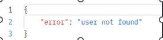

# API Testing Project for **reqres.in**

Scopul proiectului este acela de a demonstra utilizarea unor elemente esentiale in testarea API

**Aplicatie/Site testat:** [reqres.in](https://reqres.in/api-docs/#/)

**Aplicatie folosita pentru testare:** Postman

**Linkul colectiei [aici](https://web.postman.co/workspace/My-Workspace~00b48e9e-7263-4777-8910-c76352f00a88/collection/33405957-849a7c62-638d-41f0-b55d-0ccd6ad07129)**

## Tests performed

1. **GET**
   
Metoda HTTP pentru request GET 
Rol: Solicită informații de la un server accesand un endpoint.  
Comanda GET este utilizată pentru a obține date de la un URL specific.  
Răspunsul conține informațiile cerute, cum ar fi pagini web, imagini sau alte resurse.

**Request description:** Aduce o lista de resurese ale API-ului  
**Tipuri de teste/ tehnici used:** Testare pozitiva 
**Response status code:** 200. Solicitarea a avut succes. 

Mai jos puteti regasi o fotografie a acestei comenzi:

Interogarea endpoin-ului prin metoda get are rol de testare pozitiva si rezultatul adus reprezinta o serie de culori din baza de date a API-ului.

**DELETE**
DELETE (Șterge)
Rol: Șterge o resursă de pe server.
NU AVEM rezultat returnat in campul body deoarece userul a fost sters iar actiunea este confirmata de status.
Descriere: Comanda DELETE este folosită pentru a șterge o resursă specifică de pe server. De exemplu, poți șterge un articol dintr-un blog sau un utilizator dintr-o bază de date.
Aceats interogare reprezinta o tehnica de testare pozitiva.

Aceats interogare reprezinta o tehnica de testare pozitiva.

.............

**PUT**
PUT (Înlocuiește):
Rol: Înlocuiește complet o resursă existentă sau o creează dacă nu există.

Descriere: Comanda PUT este folosită pentru a înlocui complet o resursă existentă cu una nouă. Dacă resursa nu există, este creată. Este utilizată pentru actualizări complete.

In situatia prezentata rezultatul returnat din campul “Body” ne indica faptul ca intentia de Update a fost receptionata la data si ora mentionate.

Fiind un API de test comanda nu modifica literalmente nimic ci doar interogheaza API cu privire la capacitatea de receptionare a unei comenzi PUT.

**POST**

POST (Trimite):
Rol: Trimite date către un server pentru a fi procesate.

Descriere: Comanda POST este folosită pentru a trimite date către server, de exemplu, pentru a crea un nou obiect sau a efectua o acțiune. De obicei, este utilizată în formulare web sau pentru a adăuga date într-o bază de date.
In imaginea alaturat avem exemplu de accesare a aceesare a unui endpoint de logare al API-ului cu un user, parola si adresa de email insa putem observa din raspunsul oferit in campul Body cum userul nu poate fi gasit in baza de date a Api-ului.
Motivul pentru care userul nu se regaseste este  ca nu a fost inregistrat ca user valid in baza de date anterior.

In campul Body putem vedea mesajul returnat de catre Api ce insemna ca userul nu a fost gasit.

Tehnica de testare este una de testare negativa: introducerea unor date inexistente in campul body al interogarii cu asteparea unui rezultat negative.

**Raport Final**

Avem un raport final unde se poate observa o serie de teste executate cu ajutorul Postman cat si cele care au trecut conform asteptarilor  si cele care nu au trecut.

Avem o ferestra ce ne arata scriptul testelor cat si rezultatele/raspunsul primit de la API in urma interogarii sale.

[Codul Testelor](Cod_Teste.pdf)

Mai sus avem scriptul in format PDF al intregului set de comenzi si teste

**CONCLUZIILE FINALE**

Validarea API-ului:
1. Funcționalitate: API-ul a fost testat demonstrative pentru a se asigura că toate funcționalitățile sale corespund specificațiilor inițiale.
Erori și rezolvarea lor: Au fost identificate diverse bug-uri și erori care ar fi putut afecta funcționarea aplicației.
2. Performanța:
Timp de răspuns: Testele de performanță au arătat un timp de răspuns adecvat pentru majoritatea cererilor, asigurând astfel o experiență de utilizator fluentă.
Stabilitate: API-ul a demonstrat stabilitate și fiabilitate sub diferite condiții de încărcare, tinand cont ca este un API demonstrativ.

Lectii invatate

 Procesul de testare: 

a)Importanța unei metodologii riguroase de testare pentru asigurarea calității produsului final este un must.

b)Nu intodeauna o documentatie API este corecta drept urmare o testare statica este foarte necesara pentru a aduce corectiile necesare din timp si a evita ingreunarea fazei de executie a testarii practice. 

c)Testarea minutioasa a fiecarui rezultat adus inca de la prima interogare poate evidentia erori ce nu sunt banuite din simpla citire a rezultatelor.

d)Utilizarea a macar doua tehnici de testare (negative si pozitiva in acest caz) este cruciala in descoperirea bu-urilor/erorilor unui API

